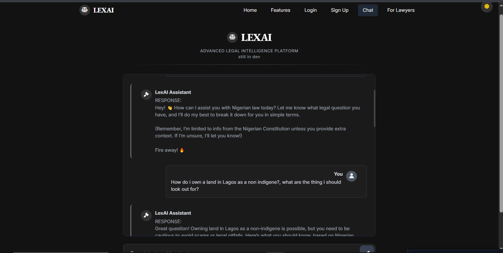

# LexAI - Legal AI Assistant

## Table of Contents
- [Overview](#overview)
- [Features](#features)
- [Tech Stack](#tech-stack)
- [Why This Approach?](#why-this-approach)
  - [Hybrid Retrieval: FAISS + BM25](#hybrid-retrieval-faiss--bm25)
  - [Groq API for LLM](#groq-api-for-llm)
  - [Custom RAG Agent](#custom-rag-agent)
- [Setup](#setup)
  - [Prerequisites](#prerequisites)
  - [Installation](#installation)
- [Usage](#usage)
  - [Local Testing](#local-testing)
  - [API Usage](#api-usage)
  - [Deployment to Northflank](#deployment-to-northflank)
<!-- - [Roadmap](#roadmap) -->
- [Architecture](#architecture)
- [Impact](#impact)
- [Future Enhancements](#future-enhancements)
- [Author](#author)
- [License](#license)
- [Acknowledgements](#acknowledgements)

## Overview
LEXAI (Legal AI Assistant) is an AI-powered LegalTech chatbot designed to make legal information accessible to all Nigerians. Built on the **Constitution of the Federal Republic of Nigeria 1999** (updated with First, Second, Third (2010), and Fourth (2017) Alterations), LEXAI empowers the 70% of Nigerians without legal access by offering a free, intuitive, and scalable solution. Using a hybrid retrieval system (FAISS + BM25) and the Groq API for natural language generation, LEXAI delivers reasoned legal insights with sub-second latency.

## Features
- **Legal Query Answering**: Combines dense (FAISS) and sparse (BM25) retrieval for precise, context-aware responses from the Nigerian Constitution.
- **Reasoned Responses**: Every reply includes explicit reasoning, citing specific Constitution sections (e.g., "Found in Chapter IV, Section 33").
- **Session Persistence**: Stores chat history per session using SQLite for continuity.
- **Scalable Design**: Modular architecture with FastAPI, ready for future enhancements like AWS migration or multimodal support.
- **Interactive Testing**: Local interactive loop for rapid development and debugging.
- **Free Deployment**: Hosted on Northflank’s free tier for zero-cost operation.

## Tech Stack
- **Backend**: Python 3.9+, FastAPI (for API)
- **Language Model**: Groq API (Llama3-8b-8192 model)
- **Vector Store**: FAISS (dense embeddings) + BM25 (sparse retrieval)
- **Database**: SQLite for chat history
- **Deployment**: Docker on Northflank
- **Preprocessing**: PyPDF for PDF text extraction
- **Logging**: Built-in Python logging for monitoring

## Why This Approach?
LEXAI’s architecture balances performance, accessibility, and scalability. Here’s why we chose each component:

### Hybrid Retrieval: FAISS + BM25
- **Why FAISS over TF-IDF?** FAISS (Facebook AI Similarity Search) provides faster, more efficient similarity search for dense embeddings, crucial for large legal documents. TF-IDF, while simpler, lacks semantic depth—FAISS captures meaning better.
- **Why Hybrid?** Combining FAISS (dense) with BM25 (sparse) ensures both semantic relevance and keyword precision. Legal queries often need exact matches (e.g., section numbers), which BM25 excels at, while FAISS handles broader context.

### Groq API for LLM
- **Why Groq?** Groq’s API offers fast, reliable access to powerful models like Llama3, ideal for generating natural, context-aware legal responses. It’s cost-effective, aligning with LEXAI’s free-to-use model.
- **Why Not SwarmaURI’s GroqModel?** Direct API calls provide more control and stability across environments, avoiding compatibility issues.

### Custom RAG Agent
- **Why Custom?** A tailored RAG agent manages conversation history and context injection, ensuring responses are grounded in the Constitution while maintaining an approachable tone.

## Setup
### Prerequisites
- Python 3.9+
- Docker (for deployment)
- Git (for cloning the repository)

### Installation
1. **Clone the Repository**:
   ```bash
   git clone https://github.com/Ksschkw/lexai.git
   cd lexai
   ```
2. **Install Dependencies**:
   ```bash
   pip install -r requirements.txt
   ```
3. **Configure Environment**:
   - Create a `.env` file in the root directory:
     ```
     GROQ_API_KEY=your_groq_api_key_here
     ```
   - Ensure no extra spaces or quotes around the API key.
4. **Prepare Data**:
   - Place the **Constitution of the Federal Republic of Nigeria 1999** PDF (274 pages, 3.88MB) in the root as `Constitution-of-the-Federal-Republic-of-Nigeria.pdf`.
   - Update `config/settings.py` with the correct `CONSTITUTION_PATH` if renamed.
<!-- 5. **Initialize the Database**:
   - The chat history database (`lexai_chat_history.db`) is created automatically on first run. -->

## Usage
### Local Testing
- Run the interactive loop:
  ```bash
  python main.py
  ```
- Type legal queries (e.g., "What are my rights?") and exit with "exit".

### API Usage
- Start the server:
  ```bash
  python main.py --server
  ```
- Send a POST request:
  ```bash
  curl -X POST "http://localhost:8000/query" -H "Content-Type: application/json" -d '{"query": "What are my rights?", "session_id": "test"}'
  ```

### EXAMPLE UI
i know the UI is ass dw


### Deployment to Northflank
1. Build the Docker image:
   ```bash
   docker build -t lexai .
   ```
2. Push to a container registry or use Northflank’s CLI.
3. Create a Northflank service:
   - Set `PORT=8000` in environment variables.
   - Deploy the image and obtain the URL (e.g., `http://lexai.northflank.app`).

<!-- ## Roadmap
- **Pre-Hackathon (June 18 - July 20, 2025)**:
  - Extract and chunk the Constitution (319 chunks by June 22).
  - Deploy a minimal prototype to Northflank by July 15.
  - Submit hackathon application with solution link by July 20.
- **Hackathon (July 21 - July 29, 2025)**:
  - Enhance with mock multimodal (PDF upload) and multiagent (translation) features in pitch.
  - Finalize demo and pitch slides by July 29.
- **Post-Hackathon (August 2025+)**:
  - Migrate to AWS with ₦500,000+ credits.
  - Implement full multimodal (voice input) and multiagent (translation, logging) features.
  - Explore freemium monetization. -->

## Architecture
- **Model-View-Controller (MVC)** Pattern:
  - **Model**: Handles data preprocessing (`document.py`), hybrid vector store (`tfidf_store.py`), Groq LLM (`groq_llm.py`), and RAG agent (`rag_agent.py`).
  - **View**: `endpoints.py` defines FastAPI routes.
  - **Controller**: `query_handler.py` manages sessions and queries.
- **Hybrid Retrieval**: Combines FAISS for dense embeddings and BM25 for sparse keyword search.
- **Modularity**: Each component adheres to SOLID principles for scalability.

## Impact
- **Market**: Targets the $35B global LegalTech market, focusing on Nigeria’s underserved population.
- **Innovation**: First free AI legal assistant for Nigeria, with hybrid retrieval and reasoned responses.
- **Accessibility**: Serves the 70% of Nigerians without legal access with a free, scalable solution.

## Future Enhancements
- **Multimodal**: Support PDF uploads and voice queries (e.g., using Tesseract, speechrecognition). -CHANGE OF PLANS, I'LL USE PADDLE_OCR, tesseract is too much effort for meh results(maybe it's just skill issues)
- **Multiagent**: Add translation (e.g., English to Igbo,Yoruba) and logging agents with LangGraph.
- **Scalability**: Migrate to AWS ECS for increased load.

## Author
Okafor Kosisochukwu Johnpaul (Kosi/Ksschkw)  
- [GitHub](https://github.com/Ksschkw)  
- [Portfolio](https://kosisochukwu.onrender.com)  
- WhatsApp: +2349019549473 *(for collaboration)*

## License
MIT License.

## Acknowledgements
- Inspired by [MYRAGAGENT](https://github.com/Ksschkw/MYRAGAGENT).
